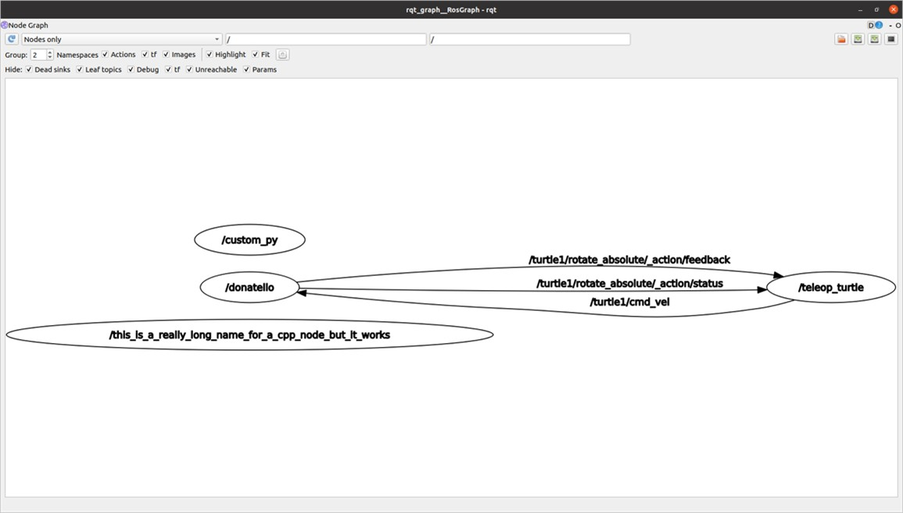
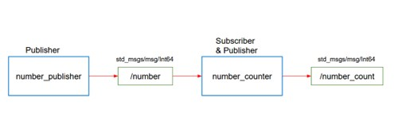

# Lab 2: Publisher/Subscribers

## I. Objectives

- Learn how to create an rqt graph
- Create your own publisher and subscriber node

---

## Recreate a Graph: (10 points)

Here is a graph that shows some nodes run with names changed. Your goal is to get the same. You’ll need to start with 4 nodes. Two of those nodes are from the turtlesim package, and two are from nodes you have already written. No need to write any new code here, you just have to start the nodes from your terminal, using the appropriate commands. 

In a pdf file, turn in the image of the rqt graph that you created, as well as the terminal commands that you used to create the graph. 

---

## Publisher/Subscriber: (30 points)

Here is a representation of the graph you should get at the end. The blue boxes are nodes and the green boxes are topics. 

You will create two nodes from scratch. In the first one you’ll have 1 publisher, and in the second one, one publisher and one subscriber. 

- The **number_publisher** node publishes a number (always the same number) on the **"/number"** topic, with the existing type **example_interfaces/msg/Int64**. 

- The **number_counter** node subscribes to the **"/number"** topic. It keeps a counter variable. Every time a new number is received, it’s added to the counter. The node also has a publisher on the **"/number_count"** topic. When the counter is updated, the publisher directly publishes the new value on the topic. 

### Hints: 
- Check what to put into the **example_interfaces/msg/Int64** with the **“ros2 interface show”** command line tool.
- In the **number_counter** node, the publisher will publish messages directly from the subscriber callback.  

---

### **Code Style Guidelines (5 points)**

An additional five points will be allocated in each homework assignment for style:
- Make sure your code is **commented**, **neat**, and **variable names make sense**.
- You should consult:
  - **Python style guide**: [PEP 8](https://peps.python.org/pep-0008/)
  - **ROS2 style guide**: [ROS 2 Code Style](https://docs.ros.org/en/rolling/The-ROS2-Project/Contributing/Code-Style-Language-Versions.html#python)

---

## What to Turn In

### **In a single zip file named** `DirectoryID_Lab2.zip`, include:
1. **Lab2.pdf**: A PDF file that contains:
   - Your answers for **Question 1**.
   - The **terminal commands** you used to run **Question 2**.
2. **Python files**:
   - `number_publisher.py`
   - `number_counter.py`
3. **Lab2_walkthrough**: A **video** showing you going through both homework questions.

---

End of **README.md**.
